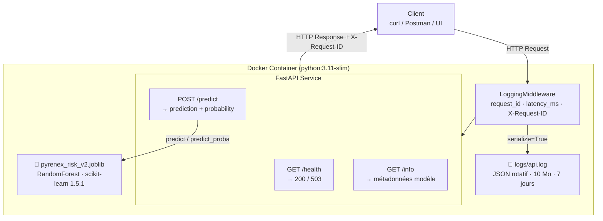

# Pyrenex Risk API — M1-B2

Service FastAPI de scoring crédit pour Pyrenex Crédit, conteneurisé avec Docker.
Sert le modèle `pyrenex_risk_v2` (RandomForest, scikit-learn 1.5.1).

---

## Démarrage en 3 commandes

```bash
# 1. Build de l'image
docker build -t pyrenex-risk-api .

# 2. Lancement du service
docker run -p 8000:8000 -v $(pwd)/logs:/home/appuser/app/logs pyrenex-risk-api

# 3. Vérification
curl http://localhost:8000/health
```

---

## Architecture



---

## Routes

| Méthode | Route | Description | Réponse |
|---|---|---|---|
| GET | `/health` | Liveness check | `200 {"status": "ok"}` / `503` si modèle non chargé |
| GET | `/info` | Métadonnées du modèle servi | `200` avec 6 clés |
| POST | `/predict` | Scoring d'une demande de prêt | `200` prediction + probability / `422` input invalide |

---

## Exemple curl /predict

```bash
curl -X POST http://localhost:8000/predict \
  -H "Content-Type: application/json" \
  -d '{
    "loan_amnt": 10000,
    "int_rate": 12.5,
    "installment": 333.0,
    "annual_inc": 60000,
    "dti": 18.5,
    "delinq_2yrs": 0,
    "fico_range_low": 680,
    "revol_util": 45.0,
    "term": "36 months",
    "grade": "B",
    "emp_length": "3 years",
    "home_ownership": "RENT",
    "verification_status": "Verified",
    "purpose": "debt_consolidation"
  }'
```

Réponse attendue :
```json
{
  "prediction": 0,
  "probability": 0.27,
  "model_version": "v2.0.0",
  "request_id": "550e8400-e29b-41d4-a716-446655440000"
}
```

---

## Tests

```bash
# En local
pytest -v

# Dans le container (volume monté)
docker run --rm \
  -v $(pwd)/tests:/home/appuser/app/tests \
  pyrenex-risk-api \
  python -m pytest tests/ -v
```

Suite pytest : 7 tests — contract test modèle + routes `/health`, `/info`, `/predict`.

---

## Versionning

La version du modèle servi est traçable à deux niveaux :

| Source | Valeur |
|---|---|
| `GET /info` → `model_version` | Version runtime du modèle chargé |
| `models/pyrenex_risk_v2.json` → `model_version` | Métadonnées figées à l'entraînement (M1-B1) |
| Tag git | `v0.1.0-api` — commit de livraison M1-B2 |

---

## Structure

```
├── app/
│   ├── main.py          # FastAPI app + lifespan + routes
│   ├── schemas.py       # Pydantic schemas (LoanApplication, Prediction)
│   └── middleware.py    # LoggingMiddleware Loguru (7 clés FastIA)
├── models/
│   ├── pyrenex_risk_v2.joblib   # modèle figé (M1-B1)
│   └── pyrenex_risk_v2.json     # métadonnées modèle
├── tests/
│   ├── conftest.py              # fixtures pytest
│   ├── test_model_contract.py   # contract test modèle (lancé en premier)
│   └── test_api.py              # tests routes API
├── logs/                        # logs rotatifs JSON (gitignored)
├── Dockerfile
├── .dockerignore
└── requirements.txt
```
